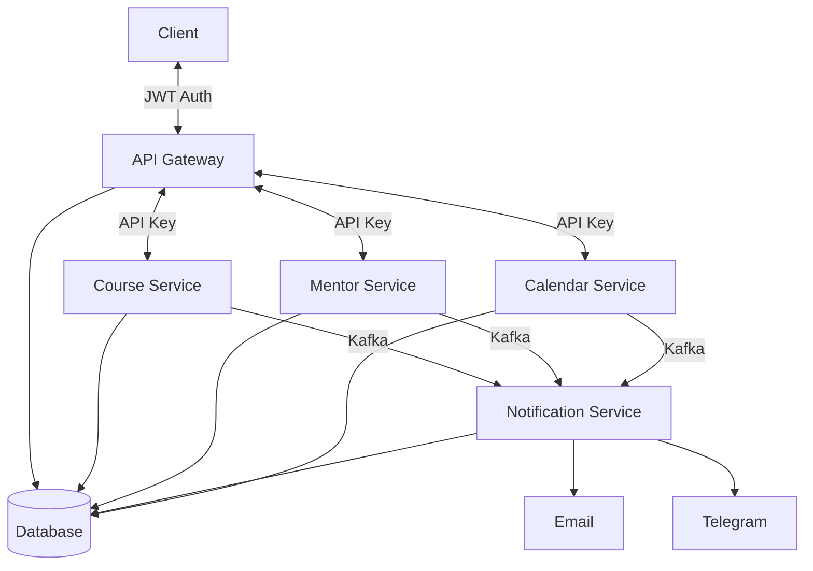

# Learning Platform Microservices

Система управления онлайн-курсами с распределенной архитектурой

## Архитектурная схема



## Состав системы

| Сервис                 | Назначение                                     |
|------------------------|------------------------------------------------|
| `api-gateway`          | Единая точка входа, авторизация, маршрутизация |
| `course-service`       | Управление курсами и модулями (CRUD, импорт)   |
| `mentor-service`       | Управление доступами, статистика прогресса     |
| `notification-service` | Отправка уведомлений (email, Telegram)         |
| `calendar-service`     | Управление календарем, букинг                  |

## Swagger API Gateway

http://localhost:8080/swagger-ui/index.html#/

## Insomnia

[Insomnia_endpoints.yaml](Insomnia_endpoints.yaml)

Импортировать в свою локальную инсомнию. 

При добавлении новых ендпоинтов в api-gateway также добавить их сюда.

## Kafka-UI

http://localhost:8086

## Билд и деплой
В корне проекта лежат два файла с переменными .env.local.example и .env.docker.example.
При деплое в Docker или локальном запуске подхватывается соответствующий файл
и переменные применяются к сервису.
### Деплой в Docker
Чтобы запустить всю систему целиком в Docker, нужно запустить скрипт `./full-deploy.sh`.
На Windows лучше запускать через Git Bash, на Linux/Mac просто в терминале.
Скрипт создает в корне проекта файл .env. 
Его не нужно удалять или отправлять в репозиторий. Он необходим только для корректного запуска.
При изменении исходного кода в любом из модулей проекта можно просто еще раз запустить скрипт.
Docker пересоберет только измененный модуль, создаст контейнер на основе нового образа
и задеплоит в контейнер. *Первый запуск идет долго из-за скачивания зависимостей в кэш*.
Кэш в Docker включен по дефолту начиная с версии `23.0`. На более ранних версиях необходимо
его настроить. В daemon.json в настройках Docker добавляем:
```
{
  "features":
    {"buildkit": true}
}
```
### Локальный запуск
Открываем docker-compose.yml, стартуем БД и кафку нажатием кнопок старта.
Также можно стартануть командой
`docker compose up database kafka-1 -d`
Далее можно запускать сервисы либо из вкладки services в intellij idea,
либо просто стартовать метод `main`. Локально запущенные сервисы работают с контейнерами
инфраструктуры благодаря .env файлам из корня проекта.
### Что важно знать про сборку
Сборка образов делится внутри Docker на слои, которые кэшируются при каждой сборке.
Каждая строчка в докерфайле - это слой. Если, проходя по докерфайлу Docker понял,
что текущий шаг больше не сходится с его кэшем, то он сбрасывает кэш.
Начиная с этой строчки все что ниже будет пересобрано, даже если нижние слои не менялись.
В связи с чем во всех докерфайлах слои расположены от самых редко меняющихся к самым часто меняющимся
сверху вниз.
Поэтому:
1. Изменение исходного кода в src каждого модуля самый дешевый вариант с точки зрения времени пересборки,
так как эти шаги расположены в самом низу докерфайлов.
2. Затем идут pom.xml файлы. Их изменение - самый дорогостоящий по времени вариант, так как они расположены в самом верху.
### Как устроена сборка через скрипт
1. Сначала скрипт запускает команду сборки образа common-lib из docker-compose.yml.
В образ входят оба модуля проекта: common-lib и reactive-common-lib.
Внутри сборки выполняется копирование обоих модулей и их установка в локальный репозиторий Maven.
Докерфайл для образа common-lib находится в модуле reactive-common-lib.
2. Затем каждый микросервис собирается на основании своего докерфайла.
За основу берется образ common-lib, собранный на предыдущем шаге.
3. Далее все собранные образы запускаются в таком порядке:
- БД и кафка поднимаются одновременно, так как не зависят ни от кого. Остальные ждут их запуска.
- Затем запускается образ api-gateway, в котором предварительно отключен запуск веб-сервера.
Контейнер запускается, накатывает миграции в БД и сразу падает. Сделано для уменьшения времени общего запуска.
Все остальные ждут успешного завершения накатывания миграций в БД.
- Когда миграции накатились, одновременно стартуют все микросервисы.
### Как добавить в сборку новый модуль или удалить старый
В новый модуль добавить докерфайл, лучше скопировать из любого из микросервисов.
Сборка сервиса делится на три стадии. В первой стадии есть список операторов COPY в самом начале.
Нужно дописать в этот список копирование pom.xml из нового сервиса
в контейнер сборки по аналогии с остальными. Затем меняем последнюю строчку,
где копируется src, нужно изменить на копирование src нового сервиса.

Например, было:
```
COPY ./pom.xml ./
COPY ./service-1/pom.xml ./service-1/
COPY ./service-2/pom.xml ./service-2/
COPY ./service-2/src ./service-2/src
```
Стало:
```
COPY ./pom.xml ./
COPY ./service-1/pom.xml ./service-1/
COPY ./service-2/pom.xml ./service-2/
COPY ./service-3/pom.xml ./service-3/
COPY ./service-3/src ./service-3/src
```
Затем в операторе RUN, в команде mvn package вписываем название нового сервиса.
Пример:
```
RUN --mount=type=cache,target=/root/.m2,id=m2cache \
    mvn -B -ntp -pl service-3 package -DskipTests
```
Далее во второй стадии меняем скопированное название сервиса на название нового сервиса.

Пример, было:
```
COPY --from=build /opt/app/api-gateway/target/*.jar ./api-gateway.jar
RUN java -Djarmode=layertools -jar api-gateway.jar extract
RUN rm ./api-gateway.jar
```
Стало:
```
COPY --from=build /opt/app/service-3/target/*.jar ./service-3.jar
RUN java -Djarmode=layertools -jar service-3.jar extract
RUN rm ./service-3.jar
```
Теперь нужно добавить конфигурацию сборки образа из нового докерфайла в docker-compose.yml.

Пример:
```
  service-3:
    build:
      context: .
      dockerfile: ./service-3/Dockerfile // указываем путь до докерфайла
    env_file:
      - .env.docker.example
    container_name: service-3 // название контейнера при запуске
    image: mentor/course-service:local // название образа после сборки
    ports:
      - "8081:8081"
    networks:
      - backend
    depends_on:
      kafka-1:
        condition: service_healthy // ждем запуска кафки
      database:
        condition: service_healthy // и БД
      api-gateway-migrations:
        condition: service_completed_successfully // а также завершения накатывания миграций
```
Все😏Теперь скрипт `full-deploy.sh` будет подхватывать новый сервис.