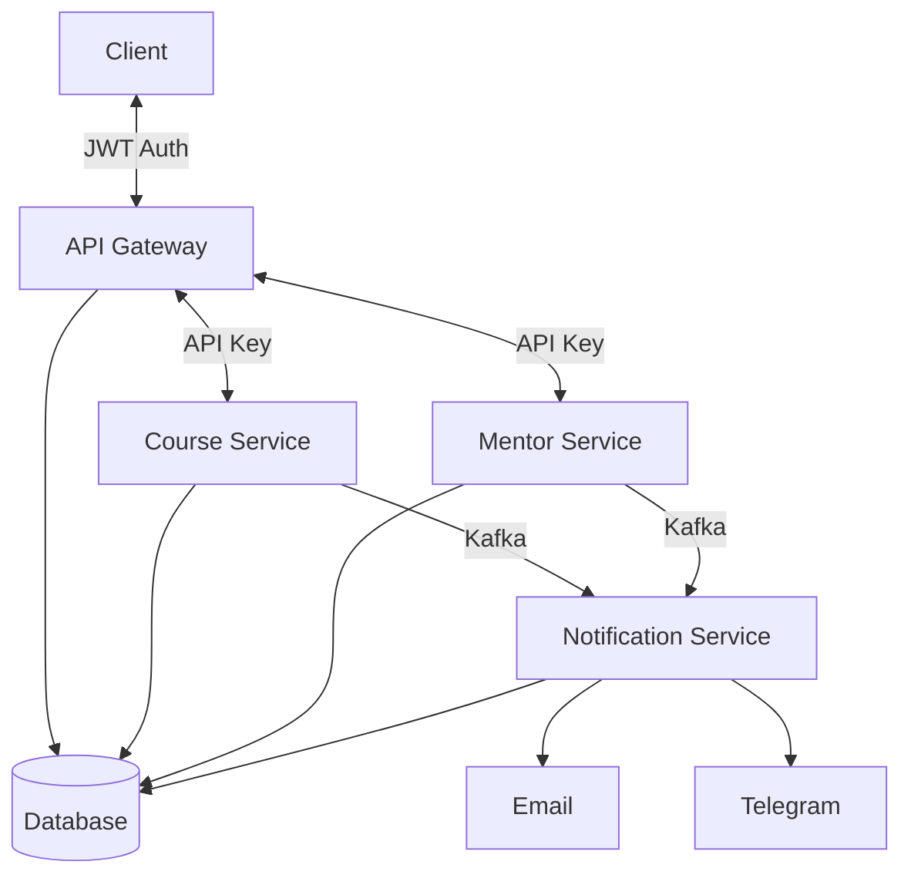

# Learning Platform Microservices

Система управления онлайн-курсами с распределенной архитектурой

## Архитектурная схема

## Состав системы

| Сервис                 | Назначение                                     |
|------------------------|------------------------------------------------|
| `api-gateway`          | Единая точка входа, авторизация, маршрутизация |
| `course-service`       | Управление курсами и модулями (CRUD, импорт)   |
| `mentor-service`       | Управление доступами, статистика прогресса     |
| `notification-service` | Отправка уведомлений (email, Telegram)         |
